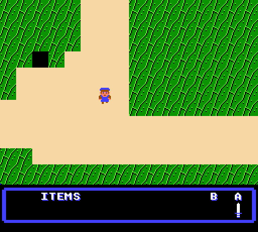
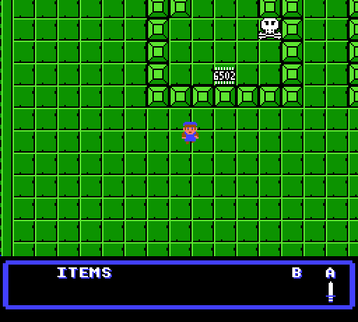

# Ludum Dare 43: Sacrifices Must be Made

In keeping with my "abuse of the theme" motif, I present *NES Quest*, because
programming for the NES is like sacrificing your sanity.

This is not a complete game: my ambition exceeded my preparedness and the
available time, but this is a playable demo.

## *NES Quest* Playable Demo

Quest through the land, searching out and collecting the components to repair
your NES:  Find the 6502 CPU, the PPU, the RAM chip and the 7404 Inverter.

Watch out for Spiders, Grumps and Skulls.  Grab a sword to defend yourself.

NES Quest draws a lot of inspration from *The Legend of Zelda* and *Gauntlet*.

### Start Screen

### Inside a Temple

## Unfinished Work

As an unfished game, the RAM and 7404 Inverter are not present in the game.
There is no win condition, goals and the player doesn't have a health system.

The movement and combat system need some fine tuning to feel more playable.

## Technical Details

This game utilizes the MMC3 mapper and sets the mirroring the the little used
Four-Screen mode, wherein the cartridge provides additional RAM to give
4 screens worth of video memory (I think only Gauntlet and maybe one other game
used this option).

The game creates a split-screen effect by using the MMC3 IRQ to create an
interrupt 192 scan-lines into the display, and then reprograms the scrolling
registers to the location of the status display.  This doesn't seem to work
correctly on a real NES - I'm not sure why yet.

MMC3 is configured such that $C000-$FFFF is mapped to the last two banks
(a rather standard configuration), and $A000-$BFFF is mapped to the 3rd
from last 8k bank.  The $8000-$9FFF region is remapped as the player progresses
through the game to provide additional level data.
